  
  
  
  
  

## ⚡ Signal

<!--LOC--><!--/LOC-->

## 🚩 Rankings

## 📝 Latest posts

<!-- BLOG-POST-LIST:START -->
- [Connecting Windows Active Directory to Azure Active Directory](https://sahanwije.medium.com/connecting-windows-active-directory-to-azure-active-directory-fb03e721917b?source=rss-264347fd4d15------2)
- [Deploying Traditional Active Directory in Azure](https://sahanwije.medium.com/deploying-traditional-active-directory-in-azure-9314166433a0?source=rss-264347fd4d15------2)
- [Deploying Ubuntu operating system in VMware. — For complete beginners](https://sahanwije.medium.com/deploying-ubuntu-operating-system-in-vmware-for-complete-beginners-b356f0633234?source=rss-264347fd4d15------2)
<!-- BLOG-POST-LIST:END -->

## ◈ Featured builds

## 🛠 Arsenal

## 🐍 Contribution snake

